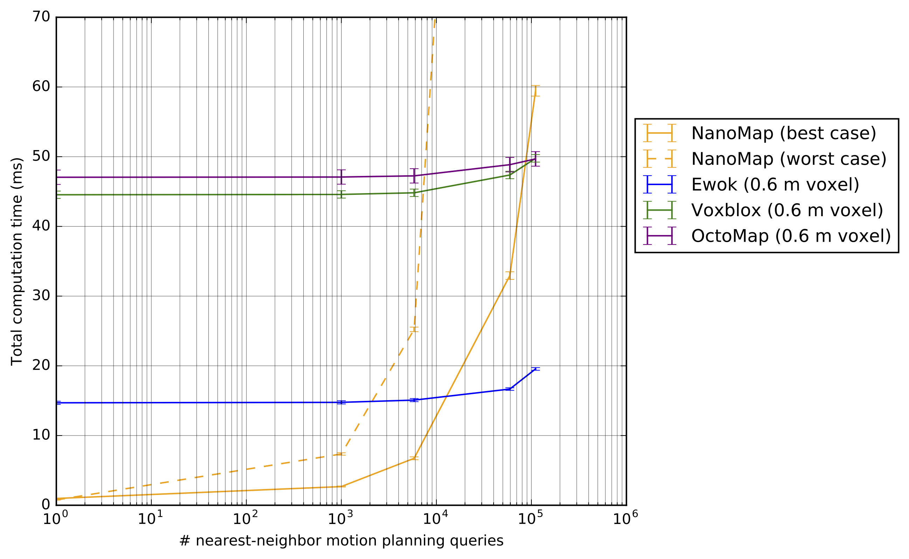
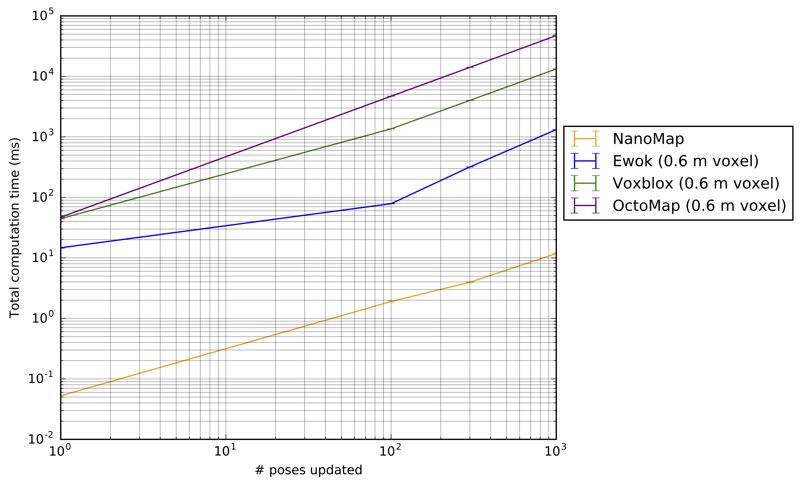

# NanoMap
## Fast, Uncertainty-Aware Proximity Queries with Lazy Search of Local 3D Data

NanoMap is an algorithm and data structure that enables uncertainty-aware proximity queries for planning.

---

  * [video description](https://www.youtube.com/watch?v=zWAs_Djd_hA)


  [](https://www.youtube.com/watch?v=zWAs_Djd_hA)
  

### Features

Key features of NanoMap include:
- Incorporates frame-specific uncertainty (due to modeled local pose uncertainty) returned along with query point
- Query algorithm returns k-nearest-neighbors from most recent view of query point
- Updates pose history information 2-4 orders of magnitude faster than fusion-based voxel packages
- Particularly fast for low amounts of queries (<10,000)

### Quickstart

```
	git clone https://github.com/peteflorence/nanomap_ros.git
	cd nanomap_ros
	catkin build
```

`benchmarking` branch contains an example, minimal node.

```
	rosrun nanomap_ros benchmarking_node

```

### Support

This ros node has been tested on:

- ROS Kinetic on Ubuntu 16.04
- ROS Indigo on Ubuntu 14.04

### Benchmarking

NanoMap is particularly fast for low amounts of motion planning queries (< ~10,000), due to its low data structure build time.  Fusion-based voxel structures take longer to build but have faster query times, causing them to be faster for > ~10,000 queries.

<p align="center">
  
</p>

Nanomap is two to four orders of magnitude faster than these other benchmarked packages at rebuilding its data structure upon receiving updated pose history information.


<p align="center">
  
</p>

(On single-core of an Intel Skylake i7.  Error bars are shown as standard error of the mean.  Docker image with all packages buildable inside provided: <https://hub.docker.com/r/flamitdraper/mapping/> )

### Required Dependencies

- Nanoflann (included as nanoflann_two.hpp)
- Eigen
- PCL

The PCL dependency is minimal.  It only uses the `pcl::PointCloud<pcl::PointXYZ>`; does not use any algorithms.  It would not be hard to replicate this type and remove the PCL dependency.  Would gladly merge that PR, PCL is a fantastic library, but is not really used here.

## Without ROS

The core of the code has no depdency on ROS.  The only parts that have ROS dependencies are the visualization components, and the example node:

- `nanomap_visualizer.h / .cc`
- `frustum_visualization.h`
- `benchmarking_node.cpp`

I have provided this as a ros package since that is how it has been used and tested.  If you would like to use this without ros, it would just need a ros-independent CMakeLists.txt / incorporate into other build system.

## Debugging NanoMap

The top of `nanomap_types.h` has `#define NANOMAP_DEBUG_PRINT false`.  Changing this to true turns on potentially useful debug prints.

A particularly useful debug print is in `NanoMapDebugPrintState()` in `nanomap.cc`.  Often I will turn the first line of this function to `if (1)` in order to print regular status.

## Contributors

- [Pete Florence](github.com/peteflorence)
- [John Carter](github.com/psiorx)
- [Jake Ware](github.com/jakeware)
- [Russ Tedrake](github.com/RussTedrake)


## Contact

Contact <peteflo@csail.mit.edu> / [peteflorence.com](http://peteflorence.com) for more information. 
